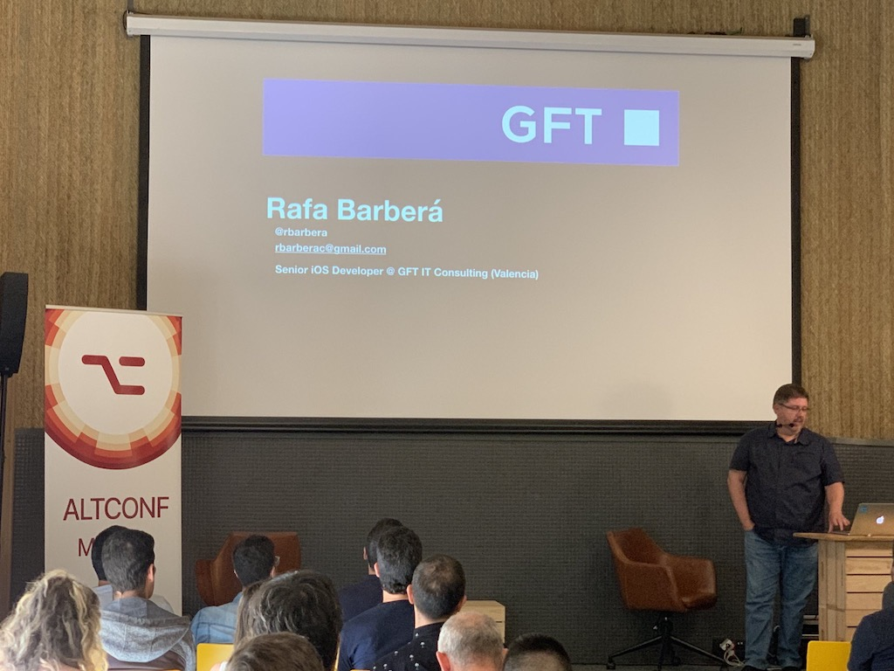
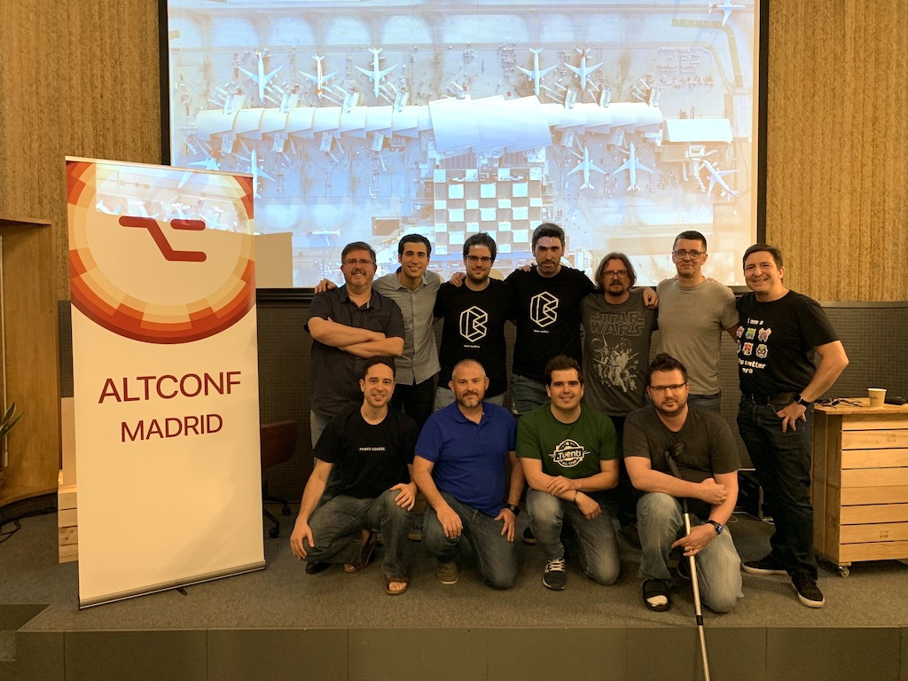

# Esta sí, esta no

Este repositiorio contiene el proyecto y el playground de la charla sobre validadores presentada en la [AltConfMadrid2019](http://madrid.altconf.com).

Del playground creado en la sesión de live coding, solo está estado final, incluyendo los operadorres <|> y |> y el álgebra de operadores de la que hablé en los ultimos minutos (revisad el amountValidator del ATM para ver su uso).

Se pude consumir tal cual o ir revisando las distintas etiquetas para ir viendo como se pasa de una solución completamente orientada a objeto y sin separación entre UI y lógica a la solución final completamente factorizada y con las dependencias inyectadas.

